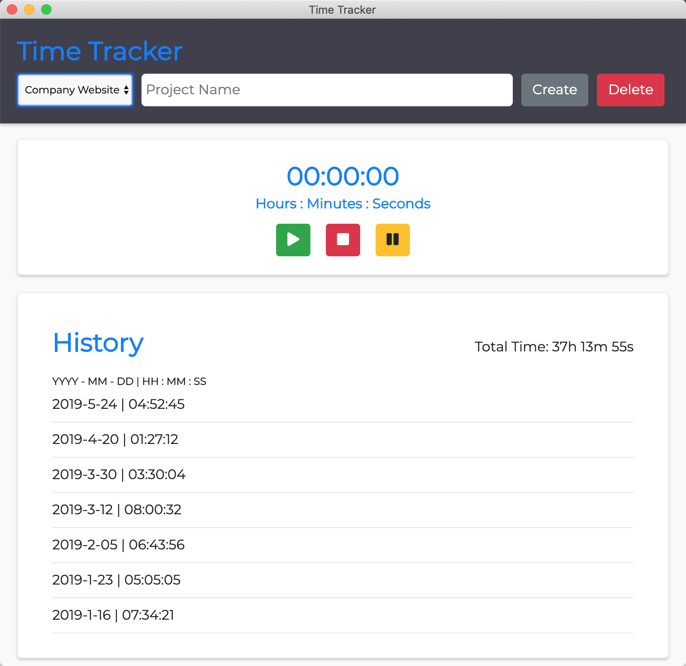

<!-- PROJECT SHIELDS -->
[![Build Status][build-shield]]()
[![Contributors][contributors-shield]]()
[![LinkedIn][linkedin-shield]][linkedin-url]

<!-- PROJECT LOGO -->
 

  <h3 align="center">Workout Randomizer</h3>

  

    Time tracking software made simple.
     
    <a href="https://github.com/sheldoncoates/Time-Tracker/issues">Report Bug</a>
   

<!-- TABLE OF CONTENTS -->
## Table of Contents

* [About the Project](#about-the-project)
  * [Built With](#built-with)
* [Getting Started](#getting-started)
  * [Prerequisites](#prerequisites)
  * [Installation](#installation)
* [Contact](#contact)
* [Acknowledgements](#acknowledgements)

<!-- ABOUT THE PROJECT -->
## About The Project

    

This project was made to help me track my time when working on different projects for different people and also better estimate project task times with reference data.

### Built With
Here is the tech I used to put together this software.
* [Electron](https://electronjs.org)

<!-- GETTING STARTED -->
## Getting Started

If you'd like to have the Time-Tracker on your machine (for fun or whatever), make sure you have the following prerequisites before trying to do installation.

### Prerequisites

Make sure you have:
* [Node.js](https://nodejs.org/en/)

### Installation

1. Once you've cloned Time-Tracker onto your machine, cd into the Time-Tracker directory and run: `npm install`. This will install all necessary dependencies.
2. Next run: `npm start` in the terminal window and Time-Tracker will now open up.

<!-- CONTACT -->
## Contact

Sheldon Coates - [LinkedIn](https://www.linkedin.com/in/sheldoncoates/) - sjrcoates@gmail.com 

<!-- ACKNOWLEDGEMENTS -->
## Acknowledgements
* [Electron](https://electronjs.org)

<!-- MARKDOWN LINKS & IMAGES -->
[build-shield]: https://img.shields.io/badge/build-passing-brightgreen.svg?style=flat-square
[contributors-shield]: https://img.shields.io/badge/contributors-1-orange.svg?style=flat-square
[linkedin-shield]: https://img.shields.io/badge/-LinkedIn-black.svg?style=flat-square&logo=linkedin&colorB=555
[linkedin-url]: https://www.linkedin.com/in/sheldoncoates/
